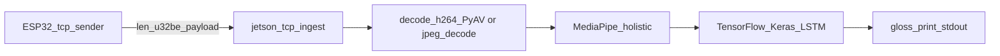

# Jetson Orin Nano Super ASL Glasses Pipeline (PoC)

This folder contains the Jetson-side code for the ESP32 glasses project.

## Stream protocol (ESP32 → Jetson)

Single TCP connection. Repeated messages:

- 4-byte big-endian unsigned length
- followed by exactly `length` bytes of payload

### Payload format options

- **H.264 access units (default)**: one complete access unit from the
  ESP32-P4 hardware encoder. This is the canonical project path.
- **JPEG frames (legacy/testing)**: one independent JPEG frame from the older
  XIAO ESP32-S3 or Raspberry Pi sender.

The ESP32 firmware determines which payload format is sent. The receiver must match.

## Pipeline overview

ESP32 sends length-prefixed frames over TCP. For the H.264 path, the receiver decodes frames, runs MediaPipe Holistic for keypoints, runs the Keras LSTM for gloss prediction, and prints stable predictions to stdout.

Until the ESP32 connects and sends frames, `main.py` blocks waiting on an internal queue—no `[gloss]` lines will appear.



### Quick test receiver for MJPEG

If you flashed the MJPEG firmware variant, run:

```bash
cd /workspace/group-project-team-narm/jetson-code
python3 decode_jpeg_tcp.py
```

## Documented runtime: container + Jetson AI Lab wheels (what we use)

This README matches the setup that was validated on **JetPack 6** using:

- A **container** (or dev environment) with the repo mounted at **`/workspace/group-project-team-narm`**
- Python **3.10** and packages under **`/opt/venv`** (typical for NVIDIA/Jetson dev images)
- Pip using the **`https://pypi.jetson-ai-lab.io/jp6/cu126`** wheel index (shown in successful installs as “Looking in indexes: …jp6/cu126”)

This is **not** the same as creating a **venv on the bare Jetson host** (`python3 -m venv` outside Docker); if you install on the host only, you may need different wheels—use the same pins only if your platform provides matching binaries.

### First-time setup (create the container)

This creates a **persistent** named container `asl_infer` (no `--rm`). After this one-time step, you can follow the **After reboot** section (`docker start -ai asl_infer`) to re-enter the same environment.

```bash
# On the Jetson host (outside the container)
cd ~/group-project-team-narm

docker run -it --name asl_infer --net=host \
  -v "$HOME/group-project-team-narm:/workspace/group-project-team-narm" \
  tensorflow2:2.21.0-r36.4.tegra-aarch64-cu126-22.04-tensorflow2_2.21.0 \
  bash
```

Then run the rest of the steps in this README **inside** the container (pip installs + `MODEL_PATH=... python3 main.py`).

**Working directory to run the app:**

```text
/workspace/group-project-team-narm/jetson-code
```

### Git on a bind-mounted repo

If Git refuses commands with **“detected dubious ownership”**:

```bash
git config --global --add safe.directory /workspace/group-project-team-narm
```

Pull updates as usual:

```bash
cd /workspace/group-project-team-narm
git pull origin main
```

### System packages (apt)

Headless OpenCV wheels may still load native libraries such as **`libxcb.so.1`**. On Ubuntu/jammy-style images:

```bash
apt-get update
apt-get install -y libxcb1
```

- If you see **`libGL.so.1` missing** and you used full **`opencv-python`**, either install `libgl1` **or** (recommended) switch to **`opencv-python-headless`** at the version pinned below so you avoid pulling GUI/OpenGL stacks into minimal containers.

## Known-good Python stack (pinned)

These versions work together for **TensorFlow 2.15.1 + MediaPipe 0.10.x + NumPy 1.26.x** when using the Jetson AI Lab index on **aarch64**:

| Package | Version | Notes |
| --- | --- | --- |
| `numpy` | `1.26.4` | TF 2.15.1 requires `<2.0` in practice here. |
| `protobuf` | `4.25.9` | TF 2.15.x expects protobuf `<5`. **Do not** pair this stack with TF 2.21 + protobuf 6 in the same env as MediaPipe 0.10.x (protobuf/runtime errors). |
| `tensorflow` | `2.15.1` | On aarch64 Jetson index, this may pull **`tensorflow-cpu-aws==2.15.1`**. |
| `opencv-python-headless` | `4.10.0.84` | Avoid `opencv-python` **4.13+** with `numpy==1.26.4` (OpenCV 4.13 wants `numpy>=2`, which conflicts with this stack). |
| `matplotlib` | `>=3.8` (binary wheels) | Install **before** resolving MediaPipe if you use full `pip install mediapipe` (see pitfalls). **`3.10.8`** was verified. |
| `mediapipe` | `0.10.18` | Install with **`--no-deps`** after matplotlib + TF to avoid pip pulling an old matplotlib **sdist** (see pitfalls). |
| `attrs`, `sentencepiece`, `sounddevice` | (latest compatible from index) | Needed for MediaPipe imports when installed with `--no-deps`. **`jax` / `jaxlib`** were **not** required for a successful `import mediapipe` in this setup. |
| `av` | `17.0.0` | PyAV for H.264 decode in `decode_h264.py`. |

See [requirements.txt](requirements.txt) for the same pins in machine-readable form (follow the header there—**MediaPipe is a separate step** with `--no-deps`).

### Pitfalls (from real installs)

1. **`pip install mediapipe` (without prep)** can try to build an old **matplotlib** from source and fail with `platform.linux_distribution` on Python 3.10. Fix: install **binary matplotlib first** (`matplotlib>=3.8 --only-binary=:all:`), **or** install **`mediapipe==0.10.18 --no-deps`** and add deps manually (see order below).
2. Mixing **TF 2.21 + protobuf 6** with **MediaPipe 0.10.x** caused protobuf / `RegisterExtension` / `GetPrototype` class of errors in troubleshooting; use the **TF 2.15.1 + protobuf 4.25.x** stack here instead.
3. After changing TensorFlow versions, **`pip`** may warn about **`onnx`** vs **`ml_dtypes`**—harmless unless you rely on ONNX in this environment.

## Exact install order (copy/paste)

Run inside the container from **`/workspace/group-project-team-narm/jetson-code`**. Use **`python3`** consistently with your image.

**1. Tooling (optional but used in practice)**

```bash
python3 -m pip install -U pip setuptools wheel
```

**2. Binary matplotlib first**

```bash
python3 -m pip install "matplotlib>=3.8" --only-binary=:all:
```

**3. Core pins**

```bash
python3 -m pip install "numpy==1.26.4" "protobuf==4.25.9"
```

**4. OpenCV headless**

Uninstall a conflicting full `opencv-python` if present, then:

```bash
python3 -m pip uninstall -y opencv-python opencv-python-headless 2>/dev/null || true
python3 -m pip install "opencv-python-headless==4.10.0.84"
```

**5. TensorFlow**

```bash
python3 -m pip install "tensorflow==2.15.1"
```

**6. MediaPipe without pulling broken matplotlib deps**

```bash
python3 -m pip install "mediapipe==0.10.18" --no-deps
python3 -m pip install attrs sentencepiece sounddevice
```

**7. PyAV**

```bash
python3 -m pip install "av==17.0.0"
```

**Alternative:** after step 2 (binary matplotlib), you can install most pinned packages in one shot, then MediaPipe:

```bash
python3 -m pip install -r requirements.txt
python3 -m pip install "mediapipe==0.10.18" --no-deps
```

(`requirements.txt` omits a plain `mediapipe` line so `pip` does not resolve it with full dependencies.)

### Verification (should all succeed)

```bash
python3 -c "import cv2, numpy as np; print('cv2', cv2.__version__, 'numpy', np.__version__)"
python3 -c "import google.protobuf; print('protobuf', google.protobuf.__version__)"
python3 -c "import tensorflow as tf; print('tf', tf.__version__)"
python3 -c "import mediapipe as mp; print('mediapipe', mp.__version__)"
python3 -c "import av; print('av', av.__version__)"
```

## Model file and `MODEL_PATH`

**Supported default for this stack:** `jetson-code/models/action.h5` (loads with **TensorFlow 2.15.1 / Keras 2.15** as used above).

Other `.h5` files under `models/` are not validated for this README’s pinned environment; they may require different TensorFlow/Keras versions.

Set the absolute path inside the container, e.g.:

```bash
export MODEL_PATH=/workspace/group-project-team-narm/jetson-code/models/action.h5
```

## Wi-Fi / networking (ESP32)

The Python stack does **not** configure Wi‑Fi: it only listens on TCP (**default `0.0.0.0:5000`**). The ESP32 must join **some** LAN (router, phone hotspot, or a Wi‑Fi AP hosted on the same machine that runs `main.py`) and open a TCP connection to that receiver’s IP.

**Default TCP port:** **`5000`** (matches `JETSON_TCP_PORT` in the ESP32 project).

### Topology options

- **Same Wi‑Fi as a router or lab AP:** ESP32 + Jetson/PC both join the SSID; set `JETSON_TCP_IP` to the Jetson/PC address on that subnet (often from DHCP).
- **Phone / travel router hotspot:** Same idea—no public internet required.
- **This machine or Jetson as Wi‑Fi AP (offline-friendly):** Use the host OS (NetworkManager) to create a hotspot on a Wi‑Fi interface. No USB dongle is required if the board already has a `wifi` device (check with `nmcli device status`).

You do **not** need campus or home Wi‑Fi for a field demo if the receiver hosts its own hotspot SSID.

### Host machine or Jetson as AP (NetworkManager)

1. **Find the Wi‑Fi interface name** (example: `wlP1p1s0` or `wlan0`):

```bash
nmcli device status
```

2. **Create and start a hotspot** (replace `IFACE`, `con-name`, `ssid`, and `password`):

```bash
sudo nmcli device wifi hotspot ifname IFACE con-name ASLHotspot ssid ASLHotspot password 'YourStrongPassphrase'
```

If the command fails because the interface is busy (e.g. connected to another SSID), disconnect first:

```bash
sudo nmcli connection down <PreviousConnectionName>
sudo nmcli device wifi hotspot ifname IFACE con-name ASLHotspot ssid ASLHotspot password 'YourStrongPassphrase'
```

3. **Get the receiver IPv4** on that interface (ESP32 `JETSON_TCP_IP`). Ubuntu-style hotspots often use **`10.42.0.1/24`** on the AP interface:

```bash
ip -4 addr show dev IFACE
```

Confirm SSID/password shown by NetworkManager if needed:

```bash
nmcli dev wifi show-password
```

4. **Run `main.py` on that same machine** (or on the Jetson if that is the AP) with default `HOST`/`PORT` so the server listens on all interfaces including the hotspot.

5. **Stop the hotspot** when finished:

```bash
sudo nmcli connection down ASLHotspot
```

Reconnect to your usual Wi‑Fi if desired:

```bash
nmcli device wifi connect YourSSID
```

To remove the saved hotspot profile:

```bash
nmcli connection delete ASLHotspot
```

### ESP32 project settings (must match the network above)

In the ESP-IDF project under **`esp32-p4/`** (repo root):

**1. `idf.py menuconfig` → Example Connection Configuration**

Use the **same** SSID and WPA passphrase as the Wi‑Fi the glasses join (e.g. the hotspot):

```text
CONFIG_ESP_WIFI_REMOTE_SSID="ASLHotspot"
CONFIG_ESP_WIFI_REMOTE_PASSWORD="YourStrongPassphrase"
```

**2. `idf.py menuconfig` → H.264 Stream Example Configuration**

Point the TCP client at the receiver IP and port (example for a typical NetworkManager hotspot gateway):

Set the Jetson IP address to `10.42.0.1` and TCP port to `5000`.

Use the **actual** IPv4 from `ip -4 addr` on the AP interface if it differs.

**3. Camera/codec mode**

The canonical firmware always uses the OV5647 MIPI-CSI camera and P4 hardware
H.264 encoder. Configure resolution, FPS, bitrate, GOP, and QP in menuconfig.

Rebuild and flash the firmware after changing these values.

### Airgapped / offline note

Runtime inference does not require WAN. **Provisioning** the Jetson/container (Docker image, `pip`, `apt`) may require network once; copy wheels or save Docker images ahead of time if the device will never reach the internet.

## Environment variables

**Required:**

- **`MODEL_PATH`** — path to the trained LSTM model (use `models/action.h5` for the documented stack)

**Optional:**

- **`HOST`** (default `0.0.0.0`)
- **`PORT`** (default `5000`)
- **`PAYLOAD_FORMAT`** (`h264` or `jpeg`; default **`h264`**)
- **`PAYLOAD_QUEUE_SIZE`** (default `64`) — ordered compressed-payload queue;
  H.264 input applies TCP backpressure instead of dropping access units
- **`DECODED_QUEUE_SIZE`** (default `2`) — latest decoded RGB frames retained
  for inference
- **`STATS_INTERVAL_SEC`** (default `5`) — pipeline performance log interval
- **`TCP_RCVBUF_BYTES`** (default `524288`) — optional larger TCP receive buffer for the ingest socket (`tcp_ingest_server.py`, `decode_jpeg_tcp.py`)
- **`PREVIEW_HTTP`** (default `0`) — if `1`, start a local MJPEG preview server (browser view of the decoded stream)
- **`PREVIEW_PORT`** (default `8000`) — port for the MJPEG preview server
- **`PREVIEW_MAX_SENTENCE`** (default `5`) — max number of gloss tokens shown in the preview “sentence” bar
- **`SEQUENCE_LENGTH`** (default `30`)
- **`STABLE_N`** (default `10`)
- **`THRESHOLD`** (default `0.5`)
- **`ACTIONS`** — comma-separated class names (default `hello,thanks,iloveyou`)

## Run

From `jetson-code/`:

```bash
cd /workspace/group-project-team-narm/jetson-code
PROTOCOL_BUFFERS_PYTHON_IMPLEMENTATION=python \
PAYLOAD_FORMAT=h264 \
MODEL_PATH=/workspace/group-project-team-narm/jetson-code/models/action.h5 \
python3 main.py
```

The process **does not exit** on its own: it listens for TCP and blocks on an internal queue until H.264 payloads arrive. **Ctrl+C** may interrupt while waiting (e.g. `KeyboardInterrupt` in `queue.get`)—expected when stopping the server.

## Live preview (browser / MJPEG, offline-friendly)

If you want to **see what the ESP32 camera sees**, enable the built-in MJPEG preview server. This works in **headless Docker** (no X11, no `cv2.imshow`) and works **offline** while using the Jetson hotspot.

Run with preview enabled:

```bash
cd /workspace/group-project-team-narm/jetson-code
PROTOCOL_BUFFERS_PYTHON_IMPLEMENTATION=python \
MODEL_PATH=/workspace/group-project-team-narm/jetson-code/models/action.h5 \
PREVIEW_HTTP=1 PREVIEW_PORT=8000 \
python3 main.py
```

Then open the preview page in a browser:

- If you are using the Jetson as a Wi‑Fi hotspot with NetworkManager (common default gateway): **`http://10.42.0.1:8000/`**
- Otherwise: use the actual IPv4 shown by `ip -4 addr show dev <your_ap_iface>` and open `http://<that_ip>:8000/`

Notes:

- You can open the page from:
  - the Jetson itself, or
  - a phone/laptop connected to the same Wi‑Fi (e.g., the Jetson hotspot SSID).
- Until frames arrive, the page will show a “waiting for frames…” placeholder.

## After reboot (persistent container: `asl_infer`)

If you are using the named container **`asl_infer`** (validated workflow), dependencies installed inside it will persist across reboots. You only need to reinstall dependencies if you delete/recreate the container.

On the Jetson host:

```bash
docker ps -a | grep asl_infer
docker start -ai asl_infer
```

Inside the container:

```bash
cd /workspace/group-project-team-narm/jetson-code
# One-time (per container): avoid TensorFlow import failures when protobuf C++ backend isn't available.
echo 'export PROTOCOL_BUFFERS_PYTHON_IMPLEMENTATION=python' >> ~/.bashrc
source ~/.bashrc

python3 -c "import tensorflow, mediapipe, cv2, av; print('deps ok')"
MODEL_PATH=/workspace/group-project-team-narm/jetson-code/models/action.h5 python3 main.py
```

## Expected output

When the server starts:

- `[tcp] listening on 0.0.0.0:5000`
- `[main] listening 0.0.0.0:5000`

When the ESP32 connects:

- `[tcp] client connected: ('<ip>', <port>)`

When predictions begin (after the rolling window fills and stability/threshold pass):

- `[gloss] <label> (conf=0.xxx)`

You may see **non-fatal** messages such as:

- `Error in cpuinfo: prctl(PR_SVE_GET_VL) failed` (common in containers)
- TensorFlow Lite / `inference_feedback_manager` warnings during MediaPipe initialization

## Troubleshooting (quick)

| Symptom | What to try |
| --- | --- |
| matplotlib `linux_distribution` / failed to build wheel | Install `matplotlib>=3.8` with `--only-binary=:all:` first, or install `mediapipe --no-deps` as above. |
| `libxcb.so.1` missing | `apt-get install -y libxcb1` |
| `libGL.so.1` missing | Prefer `opencv-python-headless==4.10.0.84` instead of full `opencv-python`, or install `libgl1`. |
| MediaPipe + protobuf errors with TF 2.21 | Use **TF 2.15.1** + **protobuf 4.25.9** stack documented here; do not mix TF 2.21 + protobuf 6 with MediaPipe 0.10.x in one env. |
| `import tensorflow` fails with protobuf `_message` / “Selected implementation cpp is not available” | Set `PROTOCOL_BUFFERS_PYTHON_IMPLEMENTATION=python` (one-off prefix or add `export PROTOCOL_BUFFERS_PYTHON_IMPLEMENTATION=python` to `~/.bashrc` inside the container). |
| No gloss output, terminal looks idle | Expected until the ESP32 connects and sends length-prefixed H.264 matching `PAYLOAD_FORMAT=h264`. |
| Browser preview doesn't load | Ensure you started with `PREVIEW_HTTP=1` and you are browsing to the Jetson's correct IP/port (hotspot often `10.42.0.1:8000`). |

## Notes

- This PoC prints stable predicted gloss tokens to stdout (no gloss→sentence and no TTS).
- The TCP stream protocol is length‑prefixed frames: `[len:u32be][payload]*` (JPEG or H.264 depending on firmware / `PAYLOAD_FORMAT`).
- H.264 payloads are always decoded in order. Load shedding happens only after
  decoding, where independent RGB frames can safely be replaced by newer ones.
